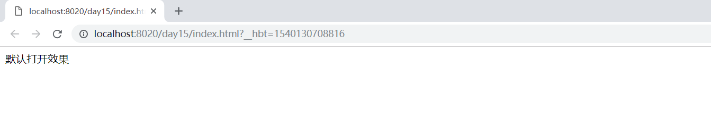
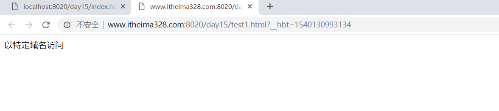
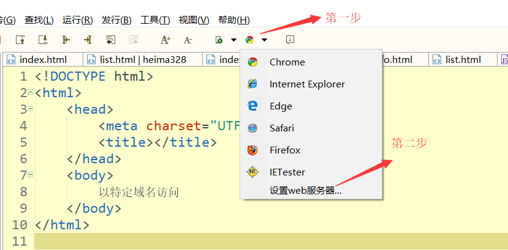
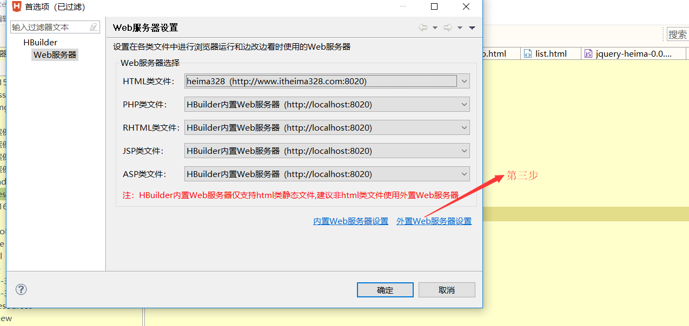
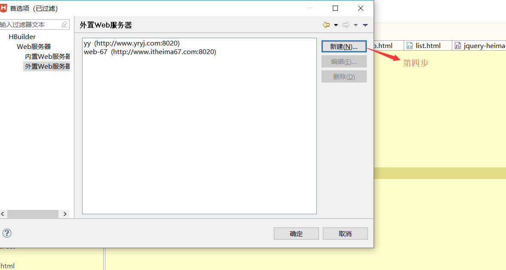
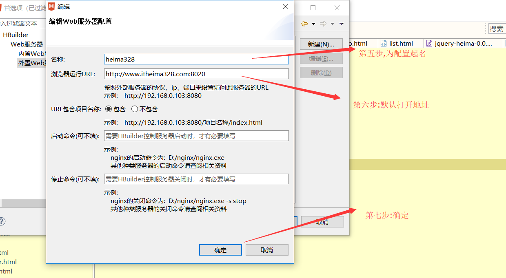
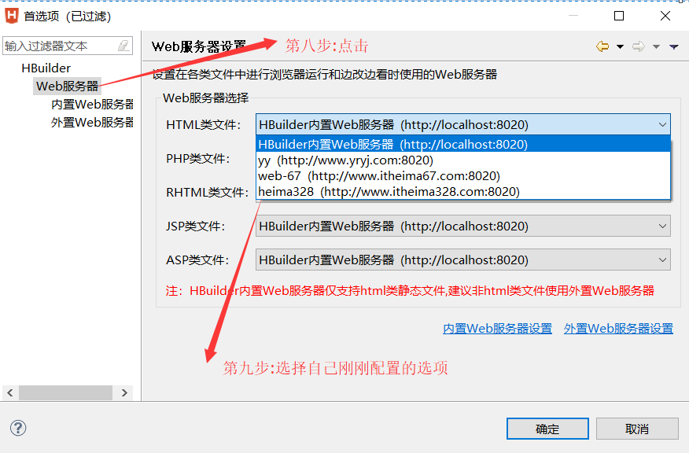

## hbuilder搭建开发环境

我们在使用hbuilder做web前端开发的时候,默认使用打开页面地址是localhost域名下,如果我们想要改变默认打开时的域名,可以对hbuilder进行配置:

1.默认情况下打开页面的效果

在这种情况下;默认打开的域名是localhost

2.如果想要默认打开的域名效果如下:

那么我们需要做如下配置:

按照上面的步骤配置完毕以后,默认打开的页面就是我们配置的域名了.